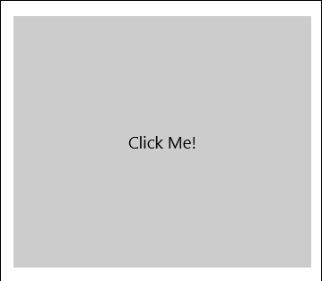
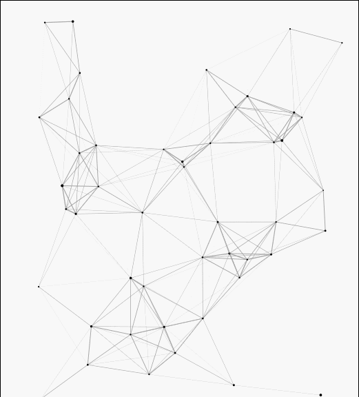
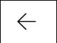
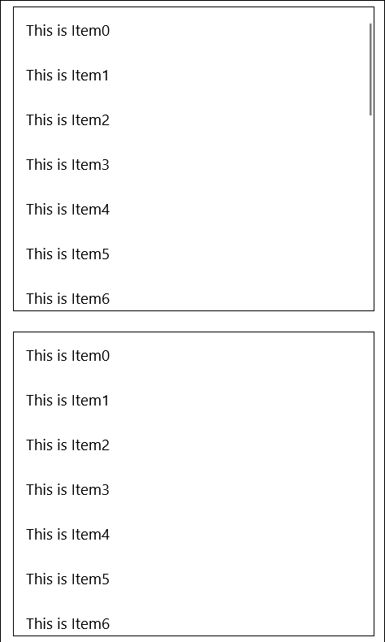
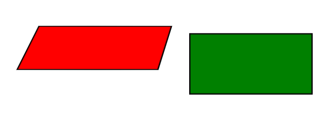
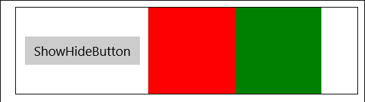
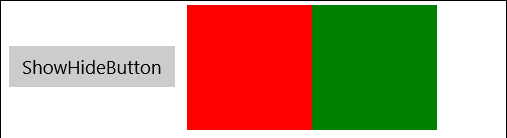

# MaterialLibs
为UWP添加一些炫酷的特效
## Documentation
### RippleStateHelper

建议:  
编写控件Style或Template，在LayoutRoot中使用m_helper:RippleHelper。
```
<Grid x:Name="LayoutRoot" 
           m_helper:RippleHelper.RippleDuration="0:0:0.8" 
           m_helper:RippleHelper.RippleColor="{ThemeResource SystemBaseLowColor}" 
           m_helper:RippleHelper.RippleHelperState="Pressed" 
           m_helper:RippleHelper.RippleRadius="30" 
/>
```
注意：
* 设置IsFillEnable后，RippleRadius属性将会失效。
### ParticleCanvas

```
<m_control:ParticleCanvas
                LineColor="DarkGray"
                ParticleColor="Gray"
/>
```
注意：
* 使用Paused属性控制是否绘制。
* 使用IsPointerEnable属性控制粒子是否响应鼠标。
### AnimationHamburgerIcon

```
<Button x:Name="HamburgerButton" Width="48" Height="48" Padding="0" Margin="10"
        HorizontalAlignment="Left" VerticalAlignment="Top"
        Background="Transparent" Foreground="Black" Click="HamburgerButton_Click">
    <Button.Resources>
        <SolidColorBrush x:Key="ButtonBackgroundPointerOver" Color="Transparent" />
        <SolidColorBrush x:Key="ButtonBackgroundPressed" Color="Transparent" />
        <SolidColorBrush x:Key="ButtonForegroundPointerOver" Color="Black" />
        <SolidColorBrush x:Key="ButtonForegroundPressed" Color="Black" />
    </Button.Resources>
    <Button.Content>
        <m_control:AnimationHamburgerIcon x:Name="anIcon" />
    </Button.Content>
</Button>
```

```
private void HamburgerButton_Click(object sender, RoutedEventArgs e)
{
    mainSplitView.IsPaneOpen = !mainSplitView.IsPaneOpen;
    anIcon.IsEnded = mainSplitView.IsPaneOpen;
}
```

### CoreSocialistValuesHelper
```
<Grid m_helper:CoreSocialistValuesHelper.IsCoreSocialistValuesEnable="True" >
</Grid>
```
不多说不多说。

### TipsRectangleHelper




* 对于ListView，GridView，ListBox，请使用TipsRectangleHelper.TipTargetName属性标记播放动画的元素，例如ListView的BorderBackground，ListBox的PressedBackground，或者自行添加到ListView的TipsRectangle、GridView的BorderBackground等自定义Tips；
* 其他控件请使用TipsRectangleHelper.State控制From到To，动画将从最后一个设置From的元素播放到第一个设置To的元素。
* 详细Style示例请见[App.xaml](Simple/App.xaml)

下面是一个例子：
ListViewItemContainerStyle请使用C:\Program Files (x86)\Windows Kits\10\DesignTime\CommonConfiguration\Neutral\UAP\(SDK版本号)\Generic\generic.xaml中9943行左右的ListViewItemExpanded Style进行自定义。
首先使用默认的BorderBackground或者添加自定义的FocusPipe，并且在VisualTransition中设置Selected到Normal的过渡持续时间达到延时隐藏的效果（根据内部实现方法不同，某些控件不需要设置，如ListBox，请自行实验）：
```
<Style TargetType="ListViewItem" x:Key="ListViewItemWithTipsContainerStyle">
    ...
    <Setter Property="Template">
        <Setter.Value>
            <ControlTemplate TargetType="ListViewItem">
                <Grid x:Name="ContentBorder"
                ...
                    <VisualStateManager.VisualStateGroups>
                        <VisualStateGroup x:Name="CommonStates">
                            <VisualStateGroup.Transitions>
                                <VisualTransition From="Selected" To="Normal" GeneratedDuration="0:0:0.001">
                                    <VisualTransition.Storyboard>
                                        <Storyboard>
                                            <ObjectAnimationUsingKeyFrames Storyboard.TargetName="FocusPipe" Storyboard.TargetProperty="(UIElement.Visibility)">
                                                <DiscreteObjectKeyFrame KeyTime="0:0:0.001" Value="Collapsed" />
                                            </ObjectAnimationUsingKeyFrames>
                                        </Storyboard>
                                    </VisualTransition.Storyboard>
                                </VisualTransition>
                            </VisualStateGroup.Transitions>
                            ...
                        </VisualStateGroup>
                    </VisualStateManager.VisualStateGroups>
                <Grid x:Name="ContentPresenterGrid"
                    ...
                </Grid>
                <Rectangle x:Name="FocusPipe" HorizontalAlignment="Left" VerticalAlignment="Center" 
                            Width="6" Height="23" Visibility="Collapsed"
                            Fill="{ThemeResource SystemControlHighlightAccentBrush}" />
            </ControlTemplate>
        </Setter.Value>
    </Setter>
</Style>
```  
然后在ListView实例添加附加属性
```
<ListView ItemContainerStyle="{StaticResource ListViewItemWithTipsContainerStyle}" ItemsSource="{x:Bind Items}" 
          m_helper:TipsRectangleHelper.TipTargetName="FocusPipe">
    <ListView.ItemTemplate>
        <DataTemplate>
            <TextBlock Text="{Binding Content}" />
        </DataTemplate>
    </ListView.ItemTemplate>
</ListView>
```

Pivot请在generic.xaml中搜索
```
<Style TargetType="PivotHeaderItem">
```
然后将相关段落复制到以下两个位置其中之一：
* Pivot控件的Resource中。
* Pivot所在的Page的Resource，或者更上层（例如App.xaml）中。
```
    <Style TargetType="PivotHeaderItem">
    ...
        <Setter Property="Template">
            <Setter.Value>
                <ControlTemplate TargetType="PivotHeaderItem">
                    <Grid x:Name="Grid" 
                    ...
                        <VisualStateManager.VisualStateGroups>
                            <VisualStateGroup x:Name="SelectionStates">
                                <VisualStateGroup.Transitions>
                                    <VisualTransition From="Unselected" To="UnselectedLocked" GeneratedDuration="0:0:0.33" />
                                    <VisualTransition From="UnselectedLocked" To="Unselected" GeneratedDuration="0:0:0.33" />
                                    <VisualTransition From="Selected" To="Unselected" GeneratedDuration="0:0:0.001" >
                                        <VisualTransition.Storyboard>
                                            <Storyboard>
                                                <ObjectAnimationUsingKeyFrames Storyboard.TargetName="FocusPipe" Storyboard.TargetProperty="(UIElement.Visibility)">
                                                    <DiscreteObjectKeyFrame KeyTime="0:0:0.001" Value="Collapsed" />
                                                </ObjectAnimationUsingKeyFrames>
                                            </Storyboard>
                                        </VisualTransition.Storyboard>
                                    </VisualTransition>
                                </VisualStateGroup.Transitions>
                                ...
                                <VisualState x:Name="Selected">
                                    <Storyboard>
                                    ...
                                    </Storyboard>
                                    <VisualState.Setters>
                                        <Setter Target="FocusPipe.(m_helper:TipsRectangleHelper.State)" Value="To" />
                                    </VisualState.Setters>
                                </VisualState>
                                SelectedPointerOver、SelectedPressed同上。
                            </VisualStateGroup>
                        </VisualStateManager.VisualStateGroups>
                        ...
                    </Grid>
                </ControlTemplate>
            </Setter.Value>
        </Setter>
    </Style>
```
注意**不要**设置x:Key和x:Name，Style会自动生效。

详细的见Simple/App.xaml，模板中设定TipsRectangleHelper.Token，然后使用VisualState控制TipsRectangleHelper.State
注意：
* 尽量不要为不同控件设置相同的Token。
* 对于ListViewBaseItemContainerStyle等VisualStateGroup中包含Pressed状态的控件，一定要给Pressed的State设置为To，不然动画不会生效。
* 一定要在VisualTransition中，处理Selected到Unselected和Selected到Normal的转换时间，让原Tips晚一段时间消失，动画才能正确播放。

### VisualHelper
* VisualHelper.Opacity(Float)：设置Visual透明度。
* VisualHelper.RotationAngle(Float)：设置Visual旋转的弧度值。
* VisualHelper.RotationAngleInDegrees(Float)：设置Visual旋转角度值。
* VisualHelper.RotationAxis(Vector3)：设置Visual在三维坐标系中的旋转角度值。
* VisualHelper.Size(Vector2)：设置Visual的大小。不一定生效。
* VisualHelper.Offset(Vector3)：设置Visual相对坐标系的位移，可能会影响到布局。
* VisualHelper.Scale(Vector3)：设置Visual的缩放，缩放中心和AnchorPoint与CenterPoint有关。
* VisualHelper.Clip(Vector4(Left,Top,Right,Bottom))：设置Visual的Clip，分别是"左,上,右,下"，含义是从边到中心收缩的距离，比如"2,2,2,2"将Visual四个边都裁剪2像素，设置为"0,0,0,0"，Visual内的子元素超出Visual范围将不可见。设置为null将取消Clip。
* VisualHelper.AnchorPoint(Vector2)：设置Visual的锚点，左上角为"0,0"，右下角为"1,1"，可以设置缩放、旋转的基准，但是可能影响布局，推荐使用VisualHelper.CenterPoint。
* 设置VisualHelper.CenterPoint(Vector3)将设置Visual的缩放和旋转基准点，例如设置VisualHelper.CenterPoint="0,50"，缩放将以Visual所在坐标系的(0,50)为中心进行缩放。
* 设置VisualHelper.CenterPoint="Bind"，会将CenterPointer绑定到自身的中心上，也就是Vector3(this.Target.Size.X / 2 ,this.Target.Size.Y / 2 ,0f);
* 设置VisualHelper.IsPerspectiveEnable="True"，给容器添加景深效果。

```
<Border m_helper:VisualHelper.IsPerspectiveEnable="True">
    <Rectangle Width="200" Height="100" m_Helper:VisualHelper.RotationAngleInDegrees="30" VisualHelper.RotationAxis="1,0,0" />
</Border>
```


### ImplicitAnimations

* ImplicitHelper.Target响应系统Tiggers，例如Target标记为Offset的动画会响应位置改变，标记为Opacity的动画会响应透明度的改变；其他例如标记为Scale，Rotation之类的，需要使用VisualHelper设置对应的Visual属性。
* ImplicitHelper.Duration设置动画播放时常。

```
<Image Source="{Binding Image}" Stretch="Uniform" 
    PointerEntered="ShowHideButton_PointerEntered" PointerExited="ShowHideButton_PointerExited"
    m_helper:VisualHelper.CenterPoint="Bind" m_helper:ImplicitHelper.Targets="Offset,Scale" m_helper:ImplicitHelper.Duration="0:0:0.33" />

private void ShowHideButton_PointerEntered(object sender, PointerRoutedEventArgs e)
{
if (sender is UIElement s)
    VisualHelper.SetScale(s, "1.15,1.15,1.15");
}

private void ShowHideButton_PointerExited(object sender, PointerRoutedEventArgs e)
{
if (sender is UIElement s)
    VisualHelper.SetScale(s, "1,1,1");
}
```

```
<Style TargetType="GridViewItem" x:Key="GridViewItemWithImplicitAnimationContainerStyle">
    <Setter Property="m_helper:ImplicitHelper.Targets" Value="Offset" />
    <Setter Property="m_helper:ImplicitHelper.Duration" Value="0:0:0.3" />
</Style>
```

### CustomTransition
* 给UIElement的添加、删除、显示与隐藏添加动画。
* 内置了Offset、Scale、Flip三组Transition，并且提供了ShowTransitionBase和HideTransitionBase，允许用户创建自定义的Transition。
* 使用ScaleShowTransition/ScaleHideTransition的UIElement建议设置m_helper:VisualHelper.CenterPoint="Bind"以启用中心缩放。
* 使用FlipShowTransition/FlipHideTransition的UIElement建议设置VisualHelper.IsPerspectiveEnable="True"以启用景深效果。

```
<StackPanel m_helper:VisualHelper.IsPerspectiveEnable="True">
    <Rectangle x:Name="rect1" Height="100" Width="100" Fill="Red" m_helper:VisualHelper.CenterPoint="Bind" >
        <m_helper:TransitionsHelper.Show>
            <m_trans:FlipShowTransition From="Left" />
        </m_helper:TransitionsHelper.Show>
        <m_helper:TransitionsHelper.Hide>
            <m_trans:ScaleHideTransition ScaleX="1.5" ScaleY="1.5" />
        </m_helper:TransitionsHelper.Hide>
    </Rectangle>
    <Rectangle x:Name="rect2" Height="100" Width="100" Fill="Green" m_helper:VisualHelper.CenterPoint="Bind">
        <m_helper:TransitionsHelper.Show>
            <m_trans:FlipShowTransition From="Right" />
        </m_helper:TransitionsHelper.Show>
        <m_helper:TransitionsHelper.Hide>
            <m_trans:OffsetHideTransition OffsetY="200" />
        </m_helper:TransitionsHelper.Hide>
    </Rectangle>
</StackPanel>
```


* 注意：某些情况下（例如StackPanel中），Transition不会播放。
* 同ConnectedAnimation类似，建议设置NavigationTransitionInfo为SuppressNavigationTransitionInfo。
* 对于在VisualState中修改布局的UIElement，使用CustomTransition可能导致布局异常。